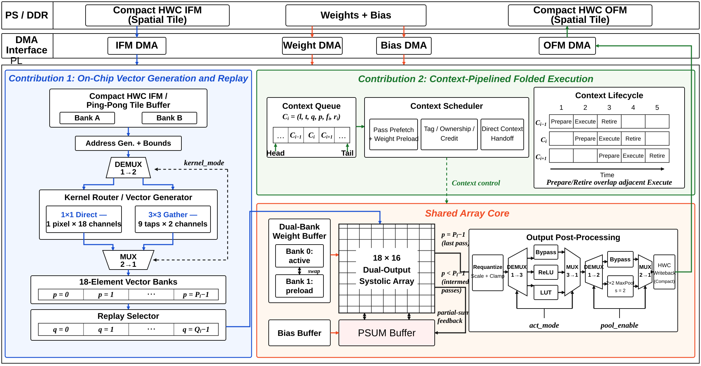
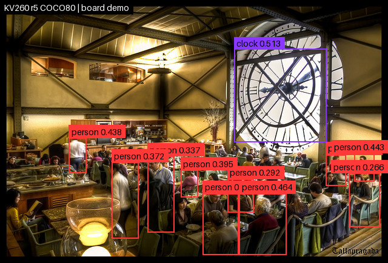
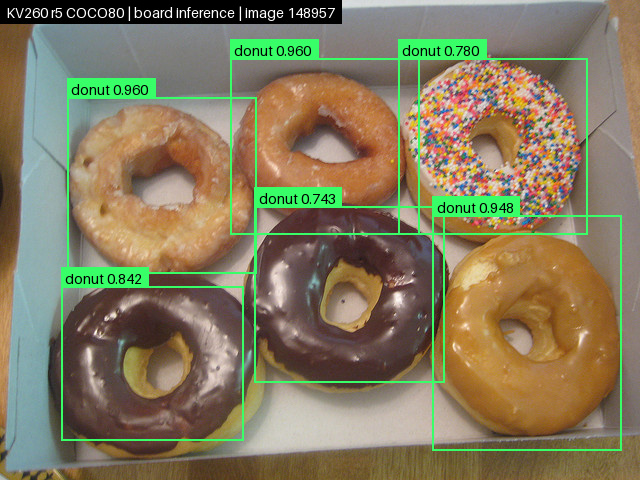
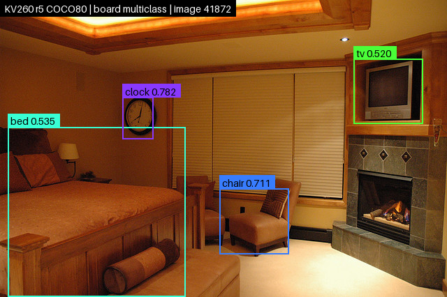

# ContextFlow：基于重放与上下文流水的量化 CNN 加速器

**语言 / Language：中文 | [English](README_EN.md)**

ContextFlow 是面向 AMD/Xilinx Kria KV260（XCK26）的完整 INT8 CNN 推理系统。项目以固定规模 `18×16` 双输出脉动阵列为计算核心，围绕折叠卷积执行中的两个系统级瓶颈展开：同一 HWC 输入随输出通道块切换被重复搬运，以及相邻折叠上下文之间的执行空泡。

当前发布版本在 200 MHz 下完成双尺度 YOLOv3-tiny 的常驻推理，实测平均延迟为 **34.943 ms**，吞吐率为 **28.618 FPS**，PL 有效吞吐率为 **165.588 GOPS**，阵列利用率为 **71.87%**。

最新预印本：[ContexFlow_preprint_thesis.pdf](output/pdf/ContexFlow_preprint_thesis.pdf)

## 核心思路

固定规模阵列执行长规约卷积时，需要沿规约维拆分为多个 `p` 轮次，并沿输出通道拆分为多个 `q` 块。ContextFlow 从空间和时间两个维度重新组织这一折叠序列。

### 1. 片上向量生成与跨输出通道块重放

- 每个紧凑 HWC 空间分块只从 DDR 读取一次。
- 片上 kernel-adaptive router 将输入直接打包为 `1×1` 向量，或按九个 tap 收集为 `3×3` 向量。
- 每个规约轮次生成 18 元素、阵列可直接消费的向量，并按 `p` 写入片上向量 bank。
- 相同的 `V[p]` 序列在不同输出通道块 `q` 之间重放，仅切换对应权重块 `W[q]`。
- 最后一个读取者完成后才释放或覆盖向量缓存，从而把输入复用保留在片上。

### 2. 面向折叠执行的上下文流水

- 将一次 `(layer, tile, q, p)` 折叠执行定义为一个上下文。
- Prepare、Execute 和 Retire 分别完成输入/权重准备、阵列计算以及 PSUM 或最终结果提交。
- 下一上下文的准备、当前上下文的计算和前一上下文的退休在独立通路上重叠。
- 双 bank 权重缓存、分组 PSUM 反馈、credit 流控和资源所有权检查共同支持直接切换。
- 当输入向量、权重、PSUM 和目标身份均就绪时，阵列所有权直接交接，不插入全局空闲周期。

## 软硬件系统

```text
DDR: compact HWC IFM / weights / bias
        |
        v
ARM Cortex-A53 bare-metal runtime
  descriptors / DMA / cache maintenance / network control
        |
        v
IFM DMA + Weight DMA + Bias DMA
        |
        v
ContextFlow PL
  HWC materializer -> vector banks -> replay selector
                   -> 18x16 systolic array
                   -> PSUM feedback / requant / activation / pooling
        |
        v
OFM DMA -> DDR feature buffers -> dual-scale YOLO decode
```

PS 负责网络描述、四路 DMA、层间张量与检测后处理；PL 负责 HWC 向量生成、权重准备、阵列执行、PSUM、量化、激活、池化和输出组织。完整网络包含 13 个 PL 卷积，池化、最近邻上采样、拼接和分支连接由 PS 配合完成。

### 整体架构

下图与论文中的整体架构图一致：上层为 PS/DDR 与四路 DMA 接口，PL 内部由片上向量生成与重放、折叠上下文调度、共享脉动阵列、PSUM 反馈及输出后处理组成。



## 当前发布结果

### 性能

| 指标 | 结果 |
| --- | ---: |
| 平台 / 频率 | XCK26/KV260 / 200 MHz |
| 常驻推理平均延迟 | **34.943 ms** |
| 常驻推理 P95 | **34.965 ms** |
| 吞吐率 | **28.618 FPS** |
| PL 平均延迟 | **33.607 ms** |
| 有效吞吐率 | **165.588 GOPS** |
| 阵列利用率 | **71.87%** |
| 样本 | 3 次独立运行，每次 20 次预热 + 1000 张计时图像 |

受控五级消融的最终阶段为 `34.978 ms`，它与上表的完整常驻推理均值属于不同测量范围，不应互相替代。消融结果还表明，片上向量生成与重放使 IFM DMA 流量降低 **19.67 倍**，并使常驻推理相对串行基线获得 **2.020 倍**加速。

### 模型精度

| 模型 | COCO val2017 图像数 | AP / AP50 |
| --- | ---: | ---: |
| FP32-416 | 5000 | 17.494% / 33.493% |
| INT8-416 | 5000 | 14.304% / 30.212% |

### 正确性与稳定性

- 128 张图像、22 个整数节点，共 2,816 条节点记录与参考实现逐字节一致。
- 板端完整网络对 5000 张 COCO val2017 图像的指标与离线产品路径一致。
- 3000 张计时图像无输出 CRC 错误。
- 10 分钟 soak 测试通过：13,184 条记录、0 协议错误、0 意外重连。

### 板端推理示例

以下结果由 KV260 上运行的完整 INT8 双尺度 YOLOv3-tiny 网络生成，采用演示阈值 `confidence=0.25`。三幅图用于直观展示拥挤场景、密集同类目标和多类别场景的板端推理效果；正式模型精度以此前 COCO val2017 表格为准。

| 拥挤人物场景（COCO 36494） | 密集同类目标（COCO 148957） | 多类别场景（COCO 41872） |
| :---: | :---: | :---: |
|  |  |  |

### 实现代价

| 资源或时序 | 数值 |
| --- | ---: |
| LUT | 56,949 |
| DSP | 650（其中阵列 576） |
| BRAM | 94 |
| URAM | 48 |
| WNS / TNS | +0.004 ns / 0 ns |
| 布局后工具估算片上功耗 | 4.008 W |

正式测量与哈希见 [34.9 ms 发布清单](docs/contextflow_34p9_release_manifest.md) 和 [机器可读证据快照](paper/lasa_journal_cn/data/evidence_snapshot.json)。功耗为布局布线后的 vectorless 工具估算，并非板端实测功耗。

## 仓库结构

```text
.
├── cal/                              DSP 与 INT8 MAC 基础单元
├── com/                              通用 RTL 流水模块
├── systolic/                         阵列、向量重放、PSUM 与上下文流水 RTL
├── sw/
│   └── vitis_2022_2/
│       ├── src/                      KV260 裸机推理运行时
│       ├── scripts/                  工程生成、部署、上板与测量脚本
│       └── boot/coco80_el1/          EL1/SD 冷启动支持
├── tb/                               RTL、软件与端到端回归测试
├── tcl/                              Vivado 工程、综合、实现和签核脚本
├── tools/
│   ├── coco80/                       量化、数据集、部署、协议与评估工具
│   ├── demo/                         板端功能和性能演示
│   ├── golden/                       调度与整数语义参考模型
│   └── power/                        功耗报告解析
├── repro/                            可复现实验入口与小型数据包
├── docs/                             发布清单、实现说明和证据文档
│   └── assets/
│       ├── architecture/             README 使用的整体架构矢量图
│       └── results/                  README 使用的板端推理示例
├── paper/
│   └── lasa_journal_cn/              冻结的实验数据、表格与论文证据源
├── release/
│   └── contextflow_34p9/             34.943 ms XSA、bitstream 与校验信息
└── output/
    └── pdf/
        └── ContexFlow_preprint_thesis.pdf   当前预印本
```

## 环境

- Windows 10/11 与 PowerShell 5 或更高版本
- AMD/Xilinx Vivado 2022.2
- AMD/Xilinx Vitis 2022.2
- Conda 环境 `pytorch_env`
- Kria KV260、JTAG 与 UART；网络部署流程还需要可用以太网连接

```powershell
conda activate pytorch_env
python --version
```

工具链默认路径为：

```text
C:\Xilinx\Vivado\2022.2
C:\Xilinx\Vitis\2022.2
```

> **路径替换说明：** 本文中的 `C:\Xilinx\...` 是工具链默认安装位置，`E:\COCO80_R5` 是示例 SD 卡盘符；如果本机安装位置或盘符不同，请替换为实际绝对路径。`<workspace>`、`<quantization_manifest.json>` 等尖括号内容也是占位符，执行命令时应替换为实际文件或目录路径，并去掉尖括号。仓库内的 `release\...`、`tools\...` 等相对路径则要求从仓库根目录执行。

## 快速启动与复现

以下命令均在仓库根目录执行。先激活 `pytorch_env`，并校验随仓库提供的硬件产物：

```powershell
conda activate pytorch_env
Get-FileHash release\contextflow_34p9\conv_accel_ps_dma_minimal.xsa -Algorithm SHA256
Get-FileHash release\contextflow_34p9\conv_accel_ps_dma_wrapper.bit -Algorithm SHA256
```

预期 SHA-256 分别为 `42d761b1cc77f1a7988d40dd71f0a1c7e1987a057bc457c7d5b55613637e3030` 和 `1ac606a279d60290935f32c5bc1a028b017d6cca4f22e623bd0bbb4baa3a613e`。

### JTAG 启动

先启动 Vivado `hw_server`，并用随仓库提供的 XSA 创建 EL3 网络运行平台。`<workspace>` 应为新的 Vitis 工作区：

```powershell
& 'C:\Xilinx\Vivado\2022.2\bin\hw_server.bat'

& 'C:\Xilinx\Vitis\2022.2\bin\xsct.bat' `
  sw\vitis_2022_2\scripts\create_coco80_net_project.tcl `
  -workspace <workspace> `
  -xsa release\contextflow_34p9\conv_accel_ps_dma_minimal.xsa `
  -execution-level el3
```

按照 [COCO80 工具说明](tools/coco80/README.md)构建网络 runner 后，通过 JTAG 下载 bitstream 和 ELF，并保持板端服务运行：

```powershell
powershell -ExecutionPolicy Bypass -File `
  sw\vitis_2022_2\scripts\run_coco80_net_board.ps1 `
  -Workspace <workspace> `
  -RunnerManifest <coco80_r5_ethernet.manifest.json> `
  -BitFile release\contextflow_34p9\conv_accel_ps_dma_wrapper.bit
```

板端服务默认使用 `192.168.10.2:5001`。将主机网卡配置为 `192.168.10.1/24`，并先用 `ping 192.168.10.2` 检查链路。

### SD 卡冷启动

建议使用不小于 16 GB 的 SD 卡。以下命令创建 `COCO80_R5` 数据目录；它不会格式化磁盘，请将 `E:` 替换为实际盘符：

```powershell
python -m tools.coco80.sd_deploy prepare-card `
  --card E:\COCO80_R5 `
  --bit release\contextflow_34p9\conv_accel_ps_dma_wrapper.bit `
  --xsa release\contextflow_34p9\conv_accel_ps_dma_minimal.xsa `
  --source-root .

python -m tools.coco80.sd_deploy install `
  --card E:\COCO80_R5 `
  --parameter-package <coco80_parameters.c8pa> `
  --quantization-manifest <quantization_manifest.json>

python -m tools.coco80.sd_deploy verify --card E:\COCO80_R5
```

真正的上电冷启动还需要 EL1 网络 runner 和 boot package。构建 EL1 runner 后执行：

```powershell
powershell -ExecutionPolicy Bypass -File `
  sw\vitis_2022_2\boot\coco80_el1\package_sd_boot.ps1 `
  -BuildDirectory <EL1-network-build> `
  -BitFile release\contextflow_34p9\conv_accel_ps_dma_wrapper.bit `
  -OutputDirectory <sd-boot-package> `
  -Python (Get-Command python).Source
```

将生成目录的内容复制到 FAT 启动分区，由 KV260 的 QSPI U-Boot 加载 bitstream 和 EL1 应用。完整目录布局、输入注册和启动检查见 [SD 部署说明](tools/coco80/README.md)与 [Vitis 运行时说明](sw/vitis_2022_2/README.md)。

### WebUI 推理测试

先通过 JTAG 或 SD 卡启动板端以太网服务，再在主机运行：

```powershell
powershell -ExecutionPolicy Bypass -File tools\coco80\run_inference_app.ps1 `
  -RunnerManifest <coco80_r5_ethernet.manifest.json> `
  -QuantizationManifest <quantization_manifest.json> `
  -OpenBrowser
```

浏览器默认打开 `http://127.0.0.1:8088/`。WebUI 将图片送入 KV260 执行完整 INT8 推理，并保存输入、原始输出、检测结果和运行元数据；它不会静默回退为主机推理。详见 [WebUI 推理说明](tools/coco80/INFERENCE_APP.md)。

## 构建与验证

### RTL 回归

XSIM 是正式 RTL 回归与签核仿真器：

```powershell
powershell -ExecutionPolicy Bypass -File tb/run_short_xsim_regression.ps1
powershell -ExecutionPolicy Bypass -File tb/run_all_xsim_regression.ps1
```

大型完整层、随机 AXIS 背压和 18×16 packed-OFM 测试由 `tb/run_large_xsim_regression.ps1` 与 `tcl/run_xsim_regression.tcl` 驱动。Icarus 仅用于轻量模块 smoke，不作为发布门禁。

### 200 MHz KV260 硬件

```powershell
& 'C:\Xilinx\Vivado\2022.2\bin\vivado.bat' -mode batch `
  -source tcl\build_kv260_system_xck26.tcl -tclargs `
  -profile abi_v2_release_200 -jobs 12
```

该 profile 统一约束 OOC 时钟、PS `pl_clk0`、加速器 `CLOCK_HZ` 和构建 metadata。降低频率、修改 burst 或放宽发布 gate 会生成不同身份的构建，不能替代冻结结果。

### Vitis 运行时与板端签核

主要入口位于：

```text
sw/vitis_2022_2/scripts/build_abi_v2_candidate.ps1
sw/vitis_2022_2/scripts/run_abi_v2_board_functional.ps1
sw/vitis_2022_2/scripts/run_abi_v2_board_performance_125.ps1
sw/vitis_2022_2/scripts/run_abi_v2_board_soak.ps1
sw/vitis_2022_2/scripts/run_coco80_net_board.ps1
sw/vitis_2022_2/scripts/run_coco80_sd_board.ps1
```

COCO80 数据准备、量化、网络协议和结果评估见 [COCO80 工具说明](tools/coco80/README.md)，裸机工程与上板流程见 [Vitis 运行时说明](sw/vitis_2022_2/README.md)，Vivado profile 和签核门禁见 [Vivado/XSIM 构建说明](tcl/README.md)。

## 上游与许可说明

项目早期模型和部署流程参考了 [adamgallas/fpga_accelerator_yolov3tiny](https://github.com/adamgallas/fpga_accelerator_yolov3tiny)。其中 `cal/cal_mul_int8_x2.v` 和 `cal/cal_mul_int8_x2_dsp.v` 源自该 Apache-2.0 项目的双 INT8 DSP 乘法设计。除此之外，本仓库围绕 KV260/XCK26 重构了阵列、HWC 向量化与重放、折叠上下文流水、PSUM 管理、DMA/Vitis 运行时以及完整验证流程。使用和再分发时请同时遵守仓库与上游项目的许可和引用要求。
